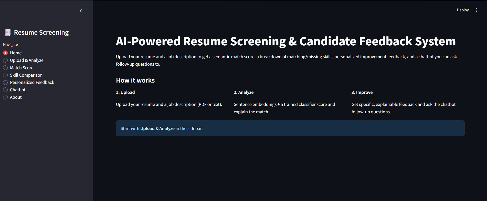

# AI-Powered Resume Screening & Candidate Feedback System

An end-to-end project that evaluates a candidate's resume against a job
description, produces a semantic match score, explains skill gaps, and
answers candidate questions through a small chatbot — built as an
applied data science / NLP project.

## Overview

Given a resume and a job description (PDF or plain text), the system:

1. Extracts and cleans the text from both documents.
2. Computes a **semantic match score** using Sentence-Transformer embeddings
   (cosine similarity), so it compares *meaning*, not just keyword overlap.
3. Compares both documents against a curated ~95-skill vocabulary to find
   **matching / missing / extra skills**.
4. Runs a **Logistic Regression classifier**, trained on 3,500 labelled
   resumes across 36 job categories (`resumes_dataset.jsonl`), to predict
   which role a resume most resembles — used as a secondary sanity check.
5. Generates **explainable, personalized feedback** from the above (a
   template-based retrieval engine, not a black-box LLM call — every
   sentence traces back to a specific number or skill).
6. Provides a **chatbot** that answers candidate questions (e.g. *"Why is
   my score low?"*) using only the computed analysis, so it can't
   hallucinate information the documents don't support.

Everything runs in a single Streamlit app.

## Features

- Upload resume and job description as PDF or `.txt` (or paste JD text directly)
- Semantic match score (0-100) with a gauge visualization
- Skill comparison: matching / missing / extra skills, with coverage %
- Resume category prediction (36 job categories) with confidence scores
- Personalized, explainable feedback report (strengths, gaps, suggestions)
- Chatbot for follow-up questions, grounded strictly in the analysis
- Graceful fallback to TF-IDF similarity if the sentence-transformer model
  can't be downloaded (e.g. no internet on first run)

## Folder Structure

```
resume_screening_project/
├── app.py                    # Streamlit app (entry point)
├── parser.py                 # PDF/TXT text extraction
├── preprocessing.py          # Text cleaning (stopwords, etc.)
├── similarity.py             # Match score, skill comparison, classification
├── feedback.py                # Explainable feedback generation
├── chatbot.py                 # Intent-matching chatbot over the analysis
├── utils.py                    # Shared paths, skill vocabulary, helpers
├── train_model.py              # Trains + saves the resume-category classifier
├── requirements.txt
├── README.md
├── data/
│   ├── resumes_dataset.jsonl        # Training data (3,500 resumes, 36 categories)
│   ├── skills_list.json             # Curated skill vocabulary (built from the dataset)
│   ├── sample_resumes/              # Sample resumes to test the app with
│   └── sample_job_descriptions/     # Sample job descriptions to test with
├── models/                    # Saved classifier + vectorizer (generated by train_model.py)
└── screenshots/                # App screenshots (add your own after running it)
```

## Installation

```bash
# 1. Clone / unzip the project, then move into it
cd resume_screening_project

# 2. (Recommended) create a virtual environment
python -m venv venv
source venv/bin/activate      # on Windows: venv\Scripts\activate

# 3. Install dependencies
pip install -r requirements.txt

# 4. Download the NLTK stopwords corpus (one-time)
python -c "import nltk; nltk.download('stopwords')"

# 5. Train the resume-category classifier (one-time, takes ~10 seconds)
python train_model.py
```

> **Note on `sentence-transformers`**: the first time you run the app, it
> downloads the `all-MiniLM-L6-v2` model (~90MB) from Hugging Face, which
> needs an internet connection. If it can't download the model, the app
> automatically falls back to TF-IDF cosine similarity for the match score
> (you'll see a note in the "Match Score" page telling you which method was used).

## Usage

```bash
streamlit run app.py
```

Then, in the browser tab that opens:

1. Go to **Upload & Analyze**, upload a resume and a job description
   (or use the sample files in `data/sample_resumes/` and
   `data/sample_job_descriptions/` to try it out quickly), and click
   **Run Analysis**.
2. Check **Match Score** for the overall score and predicted resume category.
3. Check **Skill Comparison** for exactly which skills matched, which were
   missing, and which extra skills you listed.
4. Check **Personalized Feedback** for a full explainable write-up.
5. Use **Chatbot** to ask follow-up questions like *"Why is my score low?"*
   or *"How can I improve my resume?"*

### Re-training the classifier

If you want to inspect or modify the classifier, `train_model.py` prints a
full classification report (per-category precision/recall/F1) and saves
`models/resume_classifier.pkl`, `models/tfidf_vectorizer.pkl`, and
`models/label_encoder.pkl`. Re-run it any time after changing
`preprocessing.py` or the training data.

## Model Choice

The classifier is **Logistic Regression on TF-IDF features** (not a deep
learning model). This was a deliberate choice, not a default:

- The 36 job categories are already well-separated by vocabulary (e.g.
  "Kubernetes"/"Terraform" vs. "Figma"/"Wireframing"), so a linear model on
  TF-IDF reaches ~89% test accuracy without needing anything heavier.
- It trains in seconds, which matters for a project meant to be easy to
  re-run end-to-end by anyone grading it.
- It's interpretable — useful for an "explainable" system, unlike a
  black-box deep model.

The **semantic matching** step, on the other hand, does use a small
pretrained deep learning model (Sentence-Transformers' `all-MiniLM-L6-v2`,
a distilled transformer) — this is the right tool for capturing meaning
across two differently-worded documents, which TF-IDF alone can't do well.

## Screenshots




## Future Improvements

- OCR support for scanned/image-based PDF resumes
- Support for `.docx` resumes
- A richer skill-extraction step (e.g. fuzzy matching or NER) instead of
  exact matching against a fixed vocabulary
- Batch mode: screen multiple resumes against one job description and rank them
- Persist analysis history so a user can revisit past uploads
- Fine-tune the classifier on a larger, cleaner resume dataset

## Dataset Credit

`data/resumes_dataset.jsonl` — 3,500 resumes across 36 job categories,
combining real (anonymized) and synthetically generated resumes, used here
to train the category classifier and to build the curated skill vocabulary.
